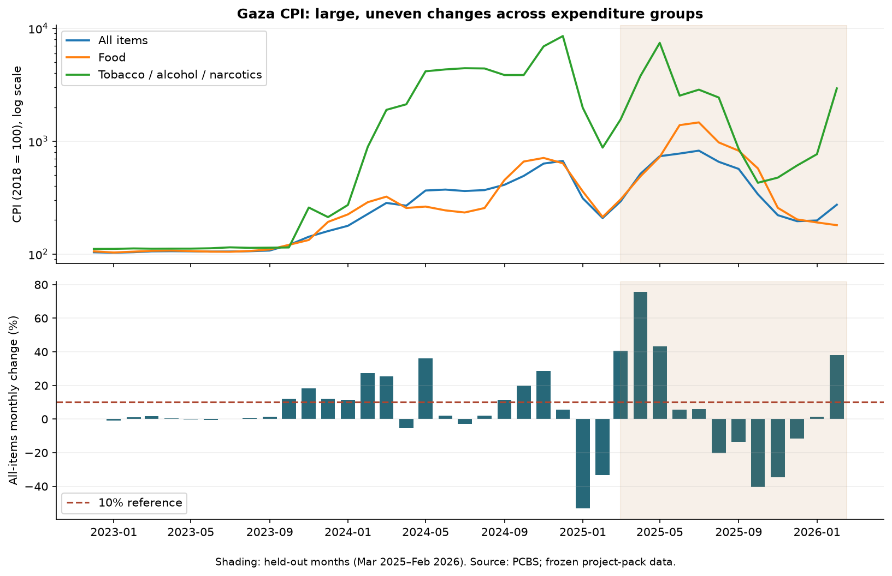
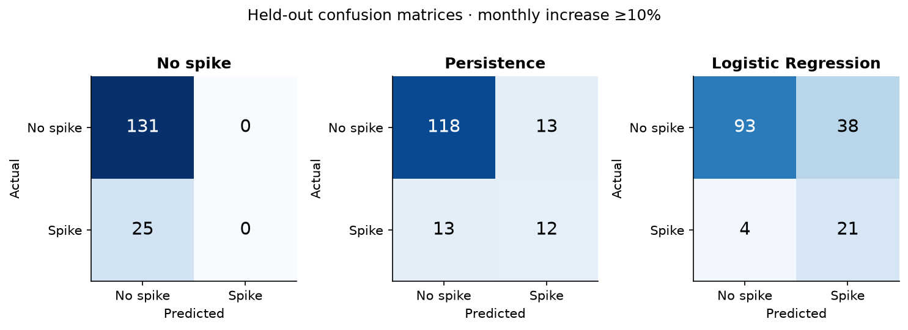
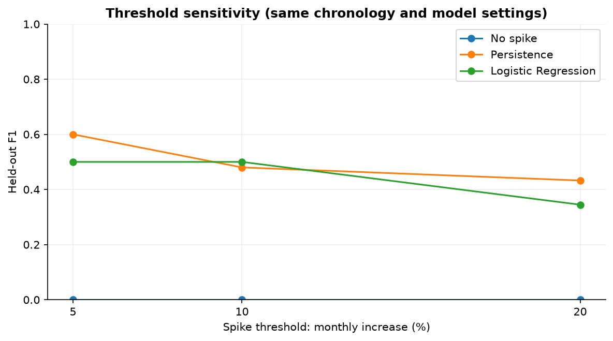
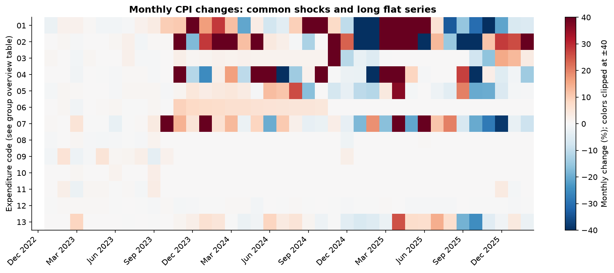

# Palestine CPI Spike Analysis

**Can recent price movements help anticipate large monthly CPI increases in Gaza?**

A **Data Analytics for Business** project by **Misk Elayan, Asil Khalil, and Sandra Shwamreh**, using official PCBS data to study monthly price movements in Gaza.

**Logistic Regression reaches F1 0.500** on the final 12 months, detecting many upward spikes but generating substantial false alarms. The simpler persistence baseline reaches 0.480. This small, volatile panel does not establish a reliable operational forecasting system.



## Actual held-out results

A spike is an expenditure group's monthly CPI increase **≥10%**, an explicit study definition, not an official PCBS threshold. Train on July 2023–February 2025; test on March 2025–February 2026. The test set has **156 group-month observations and 25 spikes** across 13 separate expenditure groups.

| Model | Accuracy | Precision | Recall | F1 |
|---|---:|---:|---:|---:|
| No spike | 0.840 | 0.000 | 0.000 | 0.000 |
| Persistence | 0.833 | 0.480 | 0.480 | 0.480 |
| Logistic Regression | 0.731 | 0.356 | 0.840 | 0.500 |

Logistic Regression finds **21 of 25** spikes with **38 false positives**. Always predicting no spike attains 84% accuracy while missing every spike, illustrating why accuracy alone is misleading.

The F1 advantage of Logistic Regression over persistence is only 0.02. Descriptive month-bootstrap intervals overlap substantially (Logistic Regression: 0.347–0.645; persistence: 0.294–0.621); these are not evidence of statistically established superiority.



## Sensitivity and findings

| Spike threshold | Actual test spikes | Persistence F1 | Logistic Regression F1 |
|---|---:|---:|---:|
| ≥5% | 30 | 0.600 | 0.500 |
| ≥10% (primary) | 25 | 0.480 | 0.500 |
| ≥20% | 19 | 0.432 | 0.345 |

Logistic Regression does not consistently outperform the simple baseline across definitions. Persistence performs best by F1 at 5% and 20%. The two earlier temporal holdouts also show unstable performance. All definitions and models are reported; test results were not used to retune them.



## Data and safeguards

- **Source:** Palestinian Central Bureau of Statistics (PCBS), Gaza CPI, base year 2018 = 100.
- **Frozen scope:** December 2022–February 2026, with January 2023 onward monthly changes. Later live-source data is excluded to preserve the original project period.
- **Validated:** 585 major-group levels and 5,070 detailed levels match the official workbook over this period.
- **Corrected extraction:** 15 missing February 2024 percentage changes recovered from observed index levels; original extracted values remain visible.
- **Avoid double counting:** model codes 01–13; exclude all-items CPI and overlapping aggregate 12+13. Detailed data has 130 codes but only 124 unique English labels.
- **Prevent look-ahead:** lagged changes, shifted 3/6-month summaries, calendar features and group identity only; train-only preprocessing; split whole months chronologically.
- **Forecast meaning:** each test month uses previously observed months with frozen fitted models. These are sequential one-step forecasts, not a 12-step forecast from one origin.
- **Regional snapshot:** contextual only, never treated as a monthly training panel.



## Reproduce

The committed, attributed numerical extract supports offline analysis; no private Drive access is needed. The published environment used **Python 3.14.7**. Direct package versions are pinned; the full environment is recorded in `requirements-lock.txt`.

```bash
git clone https://github.com/miskelayan/palestine-cpi-spike-analysis.git
cd palestine-cpi-spike-analysis
python -m venv .venv
source .venv/bin/activate
python -m pip install -r requirements.txt
python -m src.analysis
python -m unittest discover -s tests -v
python -m scripts.execute_notebook
```

On Windows, replace the activation command with `.venv\Scripts\activate`. Commands run from the repository root. The first analysis run may build a Matplotlib font cache. A Jupyter server is optional: the notebook execution command runs it headlessly and saves outputs.

[Read the executed notebook](notebooks/01_cpi_spike_analysis.ipynb). All results are produced by `src/analysis.py`; the notebook reruns that same pipeline and independently checks metrics against saved predictions. The optional [raw-file extraction audit](data/README.md) uses the existing project pack and official workbook.

## Explore the evidence

| Artifact | Contents |
|---|---|
| [Executed notebook](notebooks/01_cpi_spike_analysis.ipynb) | Data audit, EDA, features, split, models, sensitivity, interpretation |
| [Data validation](docs/data_validation.md) | Source checks, recovery of missing changes and safeguards |
| [Detailed Arabic walkthrough](docs/project_walkthrough_ar.md) | Data, code, calculations, results and explanations for presenting the project |
| [LinkedIn draft](docs/linkedin_post.md) | English and Arabic project summaries grounded in the computed results |
| [Detailed group overview](reports/tables/detailed_group_overview.csv) | Volatility recalculated by unique code, with nested series kept descriptive |
| [Methodology](docs/methodology.md) | Forecast timing, design choices, omitted ARIMA/SARIMA rationale, limitations |
| [Data provenance](data/README.md) | Source, transformations, licensing and extraction |
| [Primary metrics](reports/tables/metrics.csv) | Scores and confusion counts |
| [Predictions](reports/tables/predictions.csv) | Every test prediction, observed outcome and model score |
| [Sensitivity](reports/tables/threshold_sensitivity.csv) | Three thresholds, four models |
| [Earlier temporal holdouts](reports/tables/temporal_validation.csv) | Two train-period robustness checks |
| [Group/month metrics](reports/tables/metrics_by_group_and_month.csv) | Where performance varies |
| [Group overview](reports/tables/group_overview.csv) | Range, volatility and flat-series counts |
| [Run manifest](reports/run_manifest.json) | Exact sample periods, settings and software versions |

## Limits and attribution

Only 20 modeled training months and 12 test months are available; shared shocks mean rows are not independent. Long flat reported series and disrupted data collection limit interpretation. The study uses historical data rather than release-time vintages. Class-balanced models improve recall at a high false-alarm cost. No causal, policy or current forecasting claim is made.

ARIMA/SARIMA is deferred because the short, disrupted series does not support a convincing seasonal benchmark here; persistence provides a transparent time-series comparison.

Project team: **Misk Elayan · Asil Khalil · Sandra Shwamreh**. The project report and project pack document the research scope and data preparation. Numerical data remain attributable to **PCBS** under the source's **CC BY** designation; see [data licensing notes](data/README.md). No separate license has been assigned to project code or the academic report.
